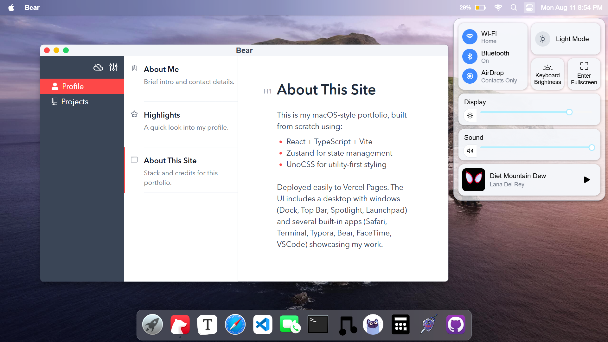
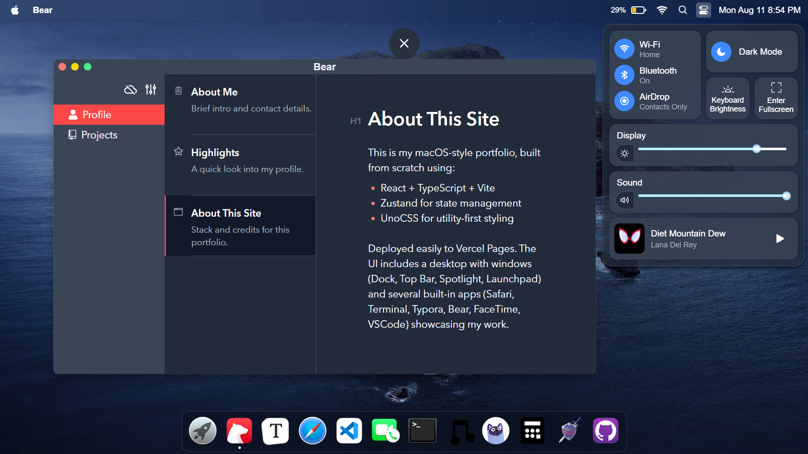

## Sudhanshu’s macOS‑Style Portfolio

An interactive portfolio that mimics the macOS desktop experience. It features a Dock, Top Bar, Launchpad, Spotlight, and windowed apps built with modern React tooling.




### Tech Stack
- React 18 + TypeScript + Vite
- UnoCSS (utility‑first styling) with preset-icons
- Zustand (state management)
- Framer Motion (Dock hover animation), react-rnd (windowing)
- Milkdown (Markdown editor), react-markdown + Prism (renderer)

### Apps Included
- Safari: start page, URL/search, or external sites via iframe
- Terminal: fake shell with `cd`, `ls`, `cat`, history, autocomplete
- Bear: Markdown reader (local/remote)
- Typora: WYSIWYG Markdown editor (Milkdown)
- FaceTime: Webcam capture (saves thumbnails)
- VSCode: Repo viewer (GitHub1s)

### Getting Started
1) Install dependencies
```bash
# Recommended
pnpm install
# or
npm install --legacy-peer-deps
```

2) Run the dev server
```bash
pnpm dev
# or
npm run dev
```

3) Build for production
```bash
pnpm build
# or
npm run build
```

### Configuration
- Update personal info in `src/configs/user.ts`.
- Dock/Apps: edit `src/configs/apps.tsx`.
- Launchpad links: `src/configs/launchpad.ts`.
- Websites for Safari start page: `src/configs/websites.ts`.
- Music (Control Center): `src/configs/music.ts`.
- About/Stats pages: markdown in `public/markdown/`.

### Deployment
This is a static SPA. Deploy the `dist` folder to your provider of choice (Vercel). Ensure Vite base is set if deploying under a subpath.

### License
MIT
